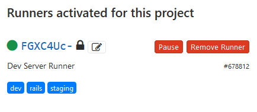

# Dev Environment

## Local Development

The project is setup to be mostly cross-compatible with Windows and Linux. [Visual Studio Code](https://code.visualstudio.com/) on Windows is used to write code. Useful extensions installed include:
- GitLens
- Prettier - Code formatter
- Rails
- Ruby
- Ruby Solargraph
- Vetur
- Settings Sync

The development tasks are ran inside Windows Subsystem Linux (WSL). It allows for a mostly complete Linux environment working inside Windows. Setting up a dev environment inside is identical to an actual Linux OS.

1. Install Ruby, preferably using rbenv or RVM. At the time of writing, `ruby 2.6.1p33` is the installed version.
2. Make sure MySQL is installed and ready to be used.
3. use `bundle install` to install the dependencies. Install bundler if the command is not avaliable.

## Database configuration

Rails has deep testing integration. Besides the `development` and `production` environment, there is also the `test` environment. All tests are ran inside this `test` enviroment to provide isolation from production and development data. Hence a seperate database also needs to be setup.

Outlined in `database.yml`, all the relevant database names are listed. Since the connection with `directus` database is also tested, there is a `directus_test` database with identical schema. **One should take care to manually update both database when changing the `directus` schema.** On your development enviroment, you should have
- PolyFYPman_dev
- PolyFYPman_test
- directus
- directus_test

these databases for the tests and dev server to run correctly. For the first two, you can simply create them empty, and run `rails db:migrate` to allow rails to setup the database. For the other two, you would need to copy the correct schema to them yourself.

## Dev Server

Once everything is correctly configured, you can run `rails server` to start the dev server. Since webpack is also used to handle frontend javascript, you can run `bin/webpack-dev-server` concurrently in another bash window to start the hot-reloading server when doing frontend development, especially related to Vue.

A rails project comes with a web server by default. Defined in `Gemfile`, this project is configured to run `puma` in dev environment, and `passenger` in production.
```
gem 'puma'
gem 'passenger', ... group: :production
```

Start `rails server` and you should see `puma` initializing.

## Staging Server

Staging server is located in [langcapadmin.edc.polyu.edu.hk](https://langcapadmin.edc.polyu.edu.hk/). The rails app here runs in production mode, and uses the same database names as the real production server. The requests are handled by Apache and passenger. Static assets (javascript, css) are served by apache only.

### Gitlab CD

The staging server has a `gitlab-runner` running, which will poll for pushs to the Gitlab repository in the `deploy` branch, and automatically run build and deploy tasks defined in `.gitlab-ci.yml`. Currently the two tasks are updating the server on the pushed code, and building this doc. The `only:` setting define where that task will be run, useful when there is more than 1 runner. 



*The Gitlab configuration page for Runners*

The runner is configured to run as the user `michaelchan`. The command used to start it is

```bash
sudo /usr/local/bin/gitlab-runner run --working-directory /home/michaelchan/ --config /etc/gitlab-runner/config.toml --service gitlab-runner --syslog=true --user michaelchan
```

The config file stored the token registered from the Gitlab CI/CD management page, and various settings like build directory.

One can refer to the `gitlab-runner` [documentation](https://docs.gitlab.com/runner/executors/shell.html) by GitLab for more information on configuration.

### Testing

The staging server is configured to run tests every time there is a push. Therefore, the deploy task is configured to migrate the test databases independently, since the testing environment here is different from a local test environment.
```
RAILS_STAGING_TEST=true rails db:migrate RAILS_ENV=test
```
The checking for environment variable `RAILS_STAGING_TEST` is also in `database.yml`.

### Apache integration

The server currently uses `passenger`, which integrates with apache in handling requests. You can find the configuration options for it [here](https://www.phusionpassenger.com/library/install/apache/install/oss/rubygems_rvm/).
