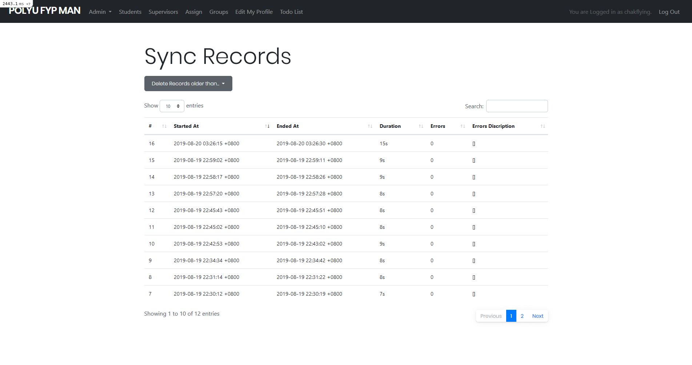

# Specific Features

## Using Ajax Datatables

Datatables from [datatables.net](https://datatables.net/) is a widely used jQuery plugin for contructing useful tables. Ajax Datatables from [ajax-datatables-rails](https://github.com/jbox-web/ajax-datatables-rails) is a wrapper for Datatables to achieve better integration between Rails and Datatables. In the initial project, a Vue component like [Vuetify](https://vuetifyjs.com/en/components/data-tables) was considered in replacing the increasingly obsolete jQuery plugin, but datatables have simpler initial configuration for ajax data loading, and provided good integration for Bootstrap, the UI elements styling currently used. Hence it is chosen for faster prototyping. However, as the complexity of the tables increased, and interactive elements like forms, buttons and undos were added, the code also got more complex and confusing. Some of the Buttons are defined in the `xxxdatatable.rb` file, undo actions are defined in jQuery .js, and additional vue form is also integrated in the `Groups` table. In the future, switching completely to a Vue table may provide better maintainability. 

The procedure from a request to displaying data in the table is roughly like so:
- The browser requests a page with Datatables in it.
- The server quickly return the page, including an empty table with columns and ajax data source defined (see `*.html.erb` files in `/app/views/` for example)
- Defined in a common js file, when the page is loaded, it will check if a table with specific id is present. If so, will initialize the corresponding dataTable object. (`app/javascript/src/manage_tables.js`)
- When the dataTable object is initialized, it will call the previously defined ajax url to fetch data. This request will be handled by the Rails dataTables object. (`app/datatables/*_datatable.rb`)
- The server processes the ajax request by getting data from database and and styling them, adding buttons and such to produce rows for display.
- The rows data is then sent back to the browser, where it is loaded onto the table.
- When the user switches to the next page or perform a search, a new ajax request is sent.

### Creating a new Ajax Datatable

- Run `rails generate datatable *ModelName*`
- Open the generated file, edit `view_columns` to define searchable columns, edit `data` to define how to process each row from a database query to display each row in the table, and edit `get_raw_records` to define how the model is queried. You can also add custom methods to help with data processing.
- in `manage_tables.js`, you can use a custom classname to identify the table to display, and initialize it in the webpage. Parameters like column width and Responsive behaviour is also defined here.
- In the relevant controller, define your action to output json which renders the Datatable class. Information about the current user is also passed here as options to the class.
```ruby
def index
  ...
  respond_to do |format|
      format.html
      format.json { render json: SupervisorDatatable.new(params, admin: is_admin?, ...) }
    end
end
```
- In current implementation, some of the html code is mixed in with the datatables model file for ease of data processing. This is a bad design pattern.

## Database Sync

Database Sync between the `directus` database and the rails one is primarily achieved with a `sync_id` column in each of the tables, tracking the corresponding entry in the other database. Some of the entries with a unique identifer (e.g. `netID`) also checks for both timestamps to update on the latest information. The database schema for `directus` is defined in `old_db_init.rb`, and the sync code is located in `old_db.rb`.

### Sync Implementation

Rails uses Active Record for its default database ORM handling. When the project started, `rails 5.2` did not have full support for multiple database connection, and `directus` uses different names for timestamp entries which is not compatible with Active Record. Therefore, additional gem `Sequel` is used to connect to `directus`. Sequel has most of the same features of finding and updating records, but uses slightly different syntax. For example, in Active Record we find rows by
```ruby
Student.find(23)
Student.find_by(netID: test01@example.com)
```
but in Sequel the bracket syntax is used instead.
```ruby
OldUser[23]
OldUser[net_id: test01@example.com]
```
The Sequel ORM is used to manage the `directus` tables, while Active Record manages the Rails database tables.

Basic custom error logging is also implemented. Most of the common error locations have error checks and will store the error text and increment an error counter. At the end of sync, the counter and error messages will be stored in a database entry, in the model `SyncRecords`. Statistics about the runtime is also stored to track performance.



### Sync Process

The process of Sync can be roughly divided into 3 steps: 
- Delete Synced records which are deleted in the `directus` database
- Update the Rails database base on each entry in the `directus` database
- Add new records in the `directus` database for unsynced entries

```ruby
      University.where.not(sync_id: nil).where.not(sync_id: OldUniversity.where(status: 1).pluck(:id)).each(&:destroy)
```
This line picks out the synced entries in our database, and deletes them if the corresponding entry in the `directus` database is missing/removed.

For Students, there is additional check of updating FYP Year if missing. Since Students and Supervisors are put in the same table in `directus`, additional check of `entry.role == '1'` is performed. The fact that role is a string type and not an integer type caused a lot of headaches.

For specific models like `supervises` and `chat_rooms_members`, it is impractical to track them by ID, since they are not meaningful in a per-record basis. Hence they are simply synced by copying the data from `directus`. After finding that the specified student and/or supervisor exists in our database, the relation will be created, and ignored otherwise.

Currently, this implementation requires loading students/supervisors repeatedly, causing slower performance during groups sync. Caching methods should be investigated to improve performance.

```ruby
OldChatRoomMember.all.each do |old_group_member|
        next if old_group_member.status != 1
        group = Group.find_by(sync_id: old_group_member.chat_room_id)
        student = Student.find_by(sync_id: old_group_member.user_id)
        supervisor = Supervisor.find_by(sync_id: old_group_member.user_id)
        ...
```

### Sync Trigger

Sync is scheduled by `Delay_job` and its extension `Delayed::RecurringJob`, defined in the bottom of `old_db_init.rb`. The block of code schedules the Sync task according to the time interval defined. Once defined, a separate process need to be started to actually run the task.

```ruby
class OldDbSyncTask
  include Delayed::RecurringJob
  run_every 2.minute
  queue 'slow_jobs'
  def perform
    OldDb.sync
  end
end
```

## Testing

> If you fixed a bug, always write a test for it.

Rails provided a standard way of testing code. Controller testing test each controller action and view rendering. Integration testing can test user actions that will involve more than one controller/model, ensuring correct communication between views and controllers, and correct behavior as whole. System test can also be written, which is a full frontend emulation using an automated browser client to interact with the application. However, there is currently no system test written. Each type of testing is located in a seperate folder in side `/test/`. There is also a specific set of `olddb` tests, which test changes to either side of the databases and the sync action between them. Currently, most of the tests are not comprehensive, and code coverage is not high.

## Vue Components

Vue components are inserted into the static pages on a per-component basis. Components are defined in `app/javascript/xxx.vue`. The code to load these components is located in `app/javascript/packs/vue_xxx.js`. They are called packs because in the specific page that this component will be loaded, there will be a `javascript_pack_tag` which will load this pack, including the vue component, which is precompiled by webpack. Also, in the rails view, we define the data that will be presented to the vue component as props in json format. This data is passed down by the controller during rendering. Javascript will then read the data and store them as props during mounting the component in this location.

```erb
<%= content_tag :div,
    id: 'todo',
    data: {
        items2: @todo_list,
        is_admin: is_admin?,
    }.to_json() do %>
  ...
<% end %>
```
The html in the do-end block is shown when the component is not mounted yet or unmounted. Currently it is a default spinner to indicate to the user that something is loading.
